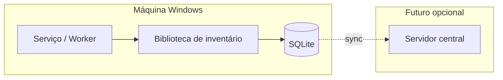

# Arquitetura (visão alvo)

## Contexto

## Código (repositório)

| Caminho | Conteúdo |
|---------|----------|
| `src/VisionAssets.Agent/` | Worker .NET 8, serviço Windows, Serilog, orquestração de ciclos e registo de `inventory_run`. |
| `src/VisionAssets.Persistence/` | SQLite, migrações (`MigrationRunner`), repositórios Dapper, SQL em `Migrations/`. |
| `src/VisionAssets.Inventory/` | Coleta WMI/CIM (`HardwareCollector`) e Registry (`SoftwareCollector`); `net8.0-windows`. |
| `installer/VisionAssets.Installer/` | MSI WiX — binários em Program Files, serviço Windows; ver [DEPLOYMENT.md](DEPLOYMENT.md). |
| `InventoryOrchestrator` (Agent) | Orquestra coleta e grava snapshot em `hardware_component` / `installed_software`. |

## Componentes (MVP)

| Componente | Responsabilidade |
|------------|------------------|
| **Serviço Windows** | Agendar execuções, ciclo de vida, health básico. |
| **Biblioteca de inventário** | Consultas WMI/CIM, leitura de Registry, normalização. |
| **Camada de persistência** | Gravação transacional, migrações, deduplicação. |
| **Configuração** | Intervalos, caminhos, flags de coleta (ex.: incluir HKCU). |

Opcional no MVP: **tray UI** apenas para “forçar inventário” e status.

## Fluxo de dados (inventário)

1. Serviço dispara **InventoryRun** (registro `pendente` → `executando`).
2. Coletores preenchem estruturas em memória.
3. Persistência faz **merge** idempotente (evitar duplicatas por execução).
4. Run finaliza com **sucesso** ou **falha** + mensagem de erro sanitizada.

## Integração central (Fase C — EPIC-006)

- **Contrato:** [inventory-v1.openapi.yaml](../contracts/inventory-v1.openapi.yaml) (evolução de PBI-041).
- **Autenticação:** Microsoft Entra ID, fluxo client credentials — [ADR-002](../decisions/ADR-002-entra-id-central-api.md).
- **Visão de fluxo:** [API-SYNC.md](API-SYNC.md).
- **Backend:** API greenfield noutro **repositório Git** ([ADR-003](../decisions/ADR-003-api-repository-separate.md)); contrato OpenAPI neste repo.

## Segurança

- Serviço com menor privilégio possível que ainda permita WMI/Registry; documentar trade-offs.
- SQLite com ACL no arquivo (documentar no guia de implantação).
